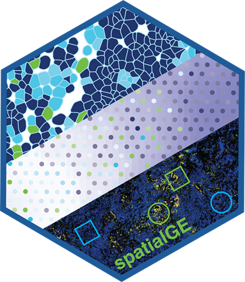
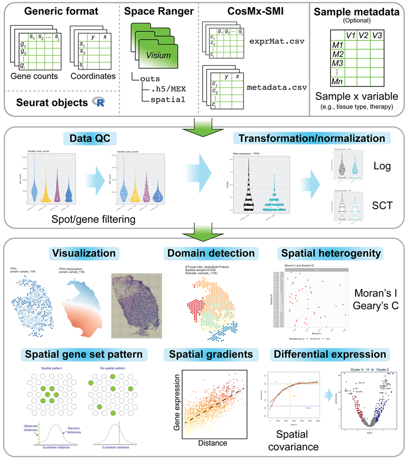

# spatialGE

An R package for the visualization and analysis of spatially-resolved
transcriptomics data, such as those generated with 10X Visium. The
**spatialGE** package features a data object (STlist: Spatial
Transctiptomics List) to store data and results from multiple tissue
sections, as well as associated analytical methods for:

-   Visualization: `STplot`, `gene_interpolation`,
    `STplot_interpolation` to explore gene expression in spatial
    context.
-   Spatial autocorrelation: `SThet`, `compare_SThet` to assess the
    level of spatial uniformity in gene expression by calculating
    Moran’s I and/or Geary’s C and qualitatively explore correlations
    with sample-level metadata (i.e., tissue type, therapy, disease
    status).
-   Tissue domain/niche detection: `STclust` to perform
    spatially-informed hierarchical clustering for prediction of tissue
    domains in samples.
-   Gene set spatial enrichment: `STenrich` to detect gene sets with
    indications of spatial patterns (i.e., non-spatially uniform gene
    set expression).
-   Gene expression spatial gradients: `STgradient` to detect genes with
    evidence of variation in expression with respect to a tissue domain.
-   Spatially-informed differential expression: `STdiff` to test for
    differentially expressed genes using mixed models with spatial
    covariance structures to account of spatial dependency among
    spots/cells. It also supports non-spatial tests (Wilcoxon’s and
    T-test).

The methods in the initial spatialGE release, technical details, and
their utility are presented in this publication:
<https://doi.org/10.1093/bioinformatics/btac145>. For details on the
recently developed methods `STenrich`, `STgradient`, and `STdiff` please
refer to the spatialGE documentation.

## Installation

The `spatialGE` repository is available at GitHub and can be installed
via `devtools`.

    options(timeout=9999999) # To avoid R closing connection with GitHub
    devtools::install_github("fridleylab/spatialGE")

## How to use spatialGE

For tutorials on how to use `spatialGE`, please go to:
<https://fridleylab.github.io/spatialGE/>

The code for `spatialGE` can be found here:
<https://github.com/FridleyLab/spatialGE>

## Function naming (v2.0.0)

In version 2.0.0, the package refactored its input handling with a
modular architecture. The primary function is now `STlist` (lowercase
‘l’). The legacy function `STList_legacy` has been preserved for
reproducibility of older workflows but is superseded and deprecated.

**New recommended function:** `STlist` - modular, extensible
implementation with platform-specific ingestors.

**Deprecated but still available:** `STList_legacy` - monolithic
implementation preserved for backward compatibility.

## [spatialGE-Web](https://spatialge.moffitt.org)

A point-and-click web application that allows using spatialGE without
coding/scripting is available at <https://spatialge.moffitt.org> . The
web app currently supports Visium outputs and csv/tsv gene expression
files paired with csv/tsv coordinate files.

## How to cite

When using spatialGE, please cite the following publication:

Ospina, O. E., Wilson C. M., Soupir, A. C., Berglund, A. Smalley, I.,
Tsai, K. Y., Fridley, B. L. 2022. spatialGE: quantification and
visualization of the tumor microenvironment heterogeneity using spatial
transcriptomics. Bioinformatics, 38:2645-2647.
<https://doi.org/10.1093/bioinformatics/btac145>

